# Welcome aboard Hullscope

**A personal experiment by Cristian Exer, exploring what I can build with OpenAI GPT-6 Astra. Hullscope is not a Beazley product and is not affiliated with, sponsored by, or endorsed by Beazley.**

Released under the [MIT License](LICENSE). Third-party dependencies and fonts retain their [own licenses](THIRD_PARTY_NOTICES.md).

**Get curious about what makes a ship work.** Hullscope is an interactive 3D maritime explorer spanning 28 real vessel families, from harbour tugs and icebreakers to container giants and floating offshore platforms. There is also one gloriously irresponsible bonus: [**the Black Pearl**](https://hullscope.cristianexer.dev/Hullscope/#/vessel/black-pearl), an original interpretation of Jack Sparrow’s fictional sailing ship with **1,521 meaningful selectable components**.

Start with a ship. Peel back its hull, follow its systems, inspect a component, or take the helm. Each vessel connects a navigable model with plain-language engineering explanations and reference notes.

[Launch Hullscope](https://hullscope.cristianexer.dev/Hullscope/) · [Get started](#run-it-locally) · [Explore the app](#find-your-sea-legs) · [Build models](#work-on-models-and-content) · [Evidence & limits](#what-these-models-represent) · [Deployment](#publish-with-github-pages)

> **Live release verified — 8 September 2026.** [Open Hullscope](https://hullscope.cristianexer.dev/Hullscope/) or read the [QA record](docs/QA.md) for browser coverage, model checks and simulation limits.

## Find your sea legs

| Try this | What you can discover |
| --- | --- |
| **Pick a vessel** | Explore 28 real vessel families plus the Black Pearl in **Special**, with timber decks, black sails, rigging and pirate-flavoured Performance and Risk panels. |
| **Look beneath the surface** | Switch between Exterior, X-ray, Cutaway and progressive disassembly at vessel, system or assembly level. |
| **Inspect a component** | Read its purpose, operation, dependencies, failure context and source notes. Search the collapsible **Ship systems** catalogue to find it directly. |
| **Change your perspective** | Orbit, zoom, use camera presets—including Below—or isolate a system. Reset brings the whole vessel back into view. |
| **Follow the engineering** | Take a guided tour or enable **System links** to see illustrative connections between representative assemblies. |
| **Compare the fleet** | Place two vessels together at a shared physical model scale, with comparable specifications and unknowns labelled. |
| **Take the helm** | Drive with keyboard or touch controls, a following camera and a wake. The display identifies this as approximate, real-time handling. |

**Explore, Performance and Risk** offer three ways into the knowledge. Labels are off by default; turn them on for callouts attached to visible parts. Click the scene background to deselect. Disassembly keeps your camera distance; use **Fit whole vessel** when you want to frame the separated parts. Preferences stay on your device. A keyboard-accessible text catalogue provides the component descriptions without WebGL, and reduced-motion preferences are respected.

The app runs entirely as static files. No account, database, live AIS feed, AI chat or external runtime service is required.

Rendering adapts to the device: native desktop GPUs receive soft shadows, subtle ambient occlusion and SMAA anti-aliasing. Mobile layouts use lighter model detail and a lower pixel budget; detected software renderers also skip shadows and post-processing. X-ray uses direct rendering to keep translucent anatomy clear.

### Controls at a glance

| Action | Control |
| --- | --- |
| Orbit / zoom | Drag the scene / scroll or use the on-screen controls |
| Find a component | Press `/` or open the anatomy browser |
| Inspect | Select a component in the model or catalogue |
| Drive: throttle | `W` / `S` or `↑` / `↓` |
| Drive: steer | `A` / `D` or `←` / `→` |
| Drive: stop / exit | `Space` / `Escape` |
| Drive on touch screens | Use the on-screen helm buttons |

Powered ships use an illustrative 12-knot throttle target in real time. On the **Black Pearl**, `W` sets more sail and `S` reefs it; available drive depends on wind strength and heading, with an upwind no-go sector. This simple sailing response is not a measured speed curve. **Waves** brings heavy swells; **Storm** adds larger long-period seas, gusting wind, driving rain, frequent, irregular lightning and delayed thunder. The Sound toggle controls continuous rain and surf as well as thunder. Water and hulls share the same wave field, with approximate buoyancy, wind heel, drift, damping and drag at each vessel’s physical scale. These are not vessel-specific stability or manoeuvring predictions. See [how the sea simulation works](docs/sea-simulation.md). System links are educational connections, not verified pipe or circuit routing.

## Run it locally

Use **Node.js 22** and npm. The repository includes a committed lockfile and generated web models.

```sh
npm ci
npm run dev
```

Open **http://127.0.0.1:5173/Hullscope/**. Keep the `/Hullscope/` path: it is the application's configured base. Shared vessel and component links use hash routes, so static hosting needs no route rewrites. Older Anatomy and Operations links open Explore.

To preview the compiled application:

```sh
npm run build
npm run preview
```

### Check your changes

```sh
npm run typecheck
npm run lint
npm test
npm run validate:models
npm run build
npm run test:browser
```

Local browser tests use installed Google Chrome; CI uses Playwright Chromium. When Chromium is needed, install it with `npx playwright install chromium`. Browser reports and screenshots are written to ignored `playwright-report/`, `test-results/` and `output/playwright/` directories.

For changes to a vessel, inspect its exterior, cutaway, exploded arrangement and underside as well as its semantic validation. For interface changes, exercise both a small portrait screen and a short landscape screen. See the [QA record](docs/QA.md) and [model visual review](docs/model-visual-review.md) for test conditions and limitations.

## What these models represent

Hullscope's ships are **educational reconstructions**, not survey-grade replicas or exact equipment inventories. Public identity, dimension and equipment references do not establish exact hull offsets or internal compartment layouts. Geometry fidelity and factual confidence are recorded separately, and missing facts are shown as **not verified**.

Component counts describe the authored educational models, not a real vessel's bill of materials. Decorative containers, glazing and rail instances do not count toward the meaningful-component quota. Generic risk explanations are not vessel risk scores. Missing performance curves, financial observations, insurance premiums and reliability statistics are not invented to fill gaps.

**The Black Pearl is fictional.** Its dimensions and equipment inventory are original authoring choices, not verified film specifications. Its Performance and Risk panels contain pirate humour; the real-vessel catalogue keeps its factual tone. No Disney images, film models, music or dialogue are included.

Each [vessel dossier](docs/dossiers/) records its reference configuration and reconstruction gaps. Some names identify a dated configuration before a later rename or conversion; those configurations must remain distinct. External photographs and plans are linked rather than redistributed. See the [reference-link audit](docs/reference-link-audit.md) and [third-party notices](THIRD_PARTY_NOTICES.md).

## Work on models and content

The application uses **React · TypeScript · Vite · React Three Fiber · Three.js · Zustand · Radix**. Content and compressed semantic GLBs load per vessel; shared geometry and instancing keep repeated equipment efficient.

| Area | Start here |
| --- | --- |
| Vessel records, facts and references | [`src/data/fleet.ts`](src/data/fleet.ts) |
| Shared system explanations | [`src/data/systems.ts`](src/data/systems.ts) |
| Semantic contracts and runtime schemas | [`src/data/schema.ts`](src/data/schema.ts) |
| Vessel-specific arrangements and equipment | [`src/model/build.ts`](src/model/build.ts) |
| Black Pearl’s sailing model and interiors | [`src/model/blackPearl.ts`](src/model/blackPearl.ts) · [Authoring notes](docs/black-pearl-authoring.md) |
| Curved hulls, decks and reusable geometry | [`src/model/geometry.ts`](src/model/geometry.ts) |
| Viewer engine | [`src/viewer/`](src/viewer/) |
| Reference dossiers | [`docs/dossiers/`](docs/dossiers/) |

Every selectable physical part carries a stable semantic ID and authored transform. The viewer preserves selection across detail levels. Facts carry confidence, units, dates and source identifiers independently of model fidelity.

### Regenerate the web assets

```sh
npm run models:build
npm run validate:models
```

This writes two compressed GLB detail levels and a manifest per vessel into `public/models/`, original uncompressed authoring intermediates into ignored `.tools/exchange/`, and reference/reconstruction notes into `docs/dossiers/`.

### Open editable scenes in Blender

Install Blender from its official distribution. The authoring pipeline has been exercised with **Blender 4.5.9 LTS**.

```sh
blender --background --python scripts/blender-author.py -- all
```

The script creates compressed `.blend` scenes in `assets/authoring/`, groups equipment by system, and preserves semantic IDs, parents, fidelity and explode vectors. Source geometry uses metres/Y-up; Blender scenes use metres/Z-up.

**The TypeScript authoring definitions are the source of the current web assets.** Regeneration replaces generated Blender scenes. Bring any manual Blender edits deliberately back into the source pipeline before regenerating; they do not automatically update the web models.

## Publish with GitHub Pages

The [Pages workflow](.github/workflows/pages.yml) is configured to run type checking, linting, unit tests, semantic/GLB validation, a production build and Chromium smoke checks across two shards. The complete browser suite and all-vessel visual review are run for release validation. Successful `main` builds are eligible for artifact deployment with scoped Pages/OIDC permissions and deployment concurrency. Failed checks prevent publication; browser evidence is retained for seven days.

The configured custom-domain application path is `https://hullscope.cristianexer.dev/Hullscope/`. Staging preserves `/Hullscope/` and redirects the custom-domain root while retaining query strings and hash links. It also supports the standard GitHub project host. The [Actions page](https://github.com/cristianexer/Hullscope/actions) records hosted checks and deployed-site verification for each release.

To exercise the staged artifact locally:

```sh
npm run build
npm run pages:stage
python3 -m http.server 5175 --directory .pages
```

Then, in another terminal:

```sh
HULLSCOPE_SITE_URL=http://127.0.0.1:5175/ HULLSCOPE_RELEASE_SHA=local npm run pages:verify
HULLSCOPE_TEST_URL=http://127.0.0.1:5175/Hullscope/ npm run test:browser -- --grep 'deep links restore|vessels can be visited serially'
```

Default staging targets a custom domain. Set `PAGES_BASE_PATH=/Hullscope` for the standard GitHub project host. The [staging script](scripts/stage-pages.mjs) rejects incompatible base paths and artifacts at or above the 800 MB project budget.

Each artifact includes its release revision. The [release verifier](scripts/verify-pages.mjs) checks that revision, entry assets, every vessel manifest and both GLBs for every vessel against declared sizes and binary signatures. Point `HULLSCOPE_TEST_URL` at a deployed `/Hullscope/` URL to run browser tests against that site.

### Return to a known-good release

In **Actions → Validate and deploy Hullscope → Run workflow**, choose `main` and enter a previously released commit SHA in `release_ref`. It must be an ancestor of `main`. The workflow rebuilds and revalidates that revision before deployment, without rewriting Git history. Check the deployment and verification jobs, then open a shared vessel link on the resulting site.

## Help make it better

Found an awkward interaction or a vessel detail that needs attention? Include the vessel name, a shared component link when possible, your screen size, and what you expected to happen. Reference corrections are especially useful when they include the original publisher and the configuration date.

For a contribution, keep model fidelity claims separate from factual claims, attach evidence for new specifications, and run the checks relevant to your change. The aim is a beautiful place to learn about ships, with clear sources and honest gaps.
